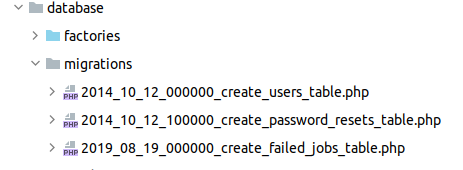
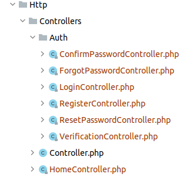
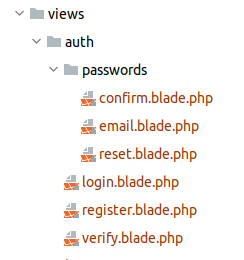
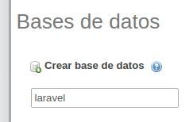
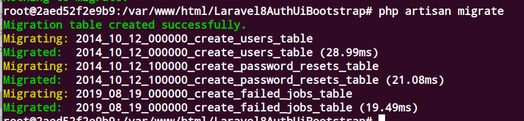

## Ecosistema del desarrollo
* Vamos a desarrollar este pequeño ejemplo de autentificación

* Podemos descargar la siguiente imagen docker donde está instalado las herramientas que necesitamos:
    * php
    * apache
    * mysql    
    * laravel
    * git
    * npm
    * node
## Laravel Authentication 

La autentificación es una de las principales tareas que cualquier aplicación web va a contener.

Por ser una tarea habitual, Laravel, como la mayoría de los frameworks, nos va a facilitar la operativa para toda su integración en nuestro desarrollo.

Hay diferentes niveles o formas de authentificar:

Pero para la mayoría de los desarrollos, una autenticación basada en usuario y password es suficiente para cubirar las necesidades
En laravel 8 aparecen Jetstream.

Con esta opción, podemos tener un **full stack** para desarrollar la aplicación completa incluyendo la autentificación.
Pero para empezar, es mejor centrarse solo en un aspecto y comprenderlo bien. 

Posteriomente se podrá usar ya cuando creemos una aplicación usando Laravel Jetstream, el cual nos permite instalar para desarrollo de cliente o bien Liwewire o Inertia.

### Authentication usando laravel/ui: (bootstrap para el diseño)
Para instalar la autenticacion en nuestra aplicación requrimos el paquete ***laravel/ui***
* descargamos  el paquete laravel/ui
<code>
 composer require laravel/ui
</code>

Instalamos la autentificación con bootstrap
 <code>
 php artisan ui bootstrap --auth
 </code>
#### node y npm

Ahora tenemos que instalar los paquetes que tenemos especificados

Para ello debemos tener instalado el gestor de paquetes **npm** y **node**
Si no está instalado, lo hacemos
- [Instalar node y npm](https://openwebinars.net/blog/como-instalar-npm/)
<code>
 curl –L https://git.io/n-install |bash
</code>

Confirmamos que esté instalado 

<code>
node -v
</code> 
<code>
 npm -v
</code>

### Instalando los paquetes de bootstrap
*Para proceder a instalar los paquetes que tenemos preparados ejecutamos 

<code>
 npm install 
</code>

* Vemos cómo tenemos nuevos ficheros en las carpetas **resources**

### Compilamos los ficheros de **resources**
Gracias al fichero webpack.mix.js, vamos a compilar los ficheros que tenemos en resource para ubicarlos en public

Vemos el ficheros en la carpeta **resource/sass**
<code>
 npm run dev
</code>

Observamos que se han creado ficheros en la carpeta public

Ahora para poder usar bootstrap y jquery en nuestros desarrollos, solo hay que referenciar los ficheros

<code>

    <!-- JQuery y scripts -->
    
    <!-- Styles bootstrap y lo que agreguemos -->
    <link href="{{ asset('css/app.css') }}" rel="stylesheet">

</code>
 
#### Recursos y ficheros creados

Una vez instalado la autenticación se han creado los siguientes recursos

Por supuesto son modificables si deseamos cambiar algún especto

Tenemos que crear la tabla dónde vamos a tener los valores de las credenciales
Con la instalación de los paquetes hemos instalado 
 * Especificacción de talblas para credenciales en forma de migración:
  
   
 * Los controladores para la autentificación
  
   
 * Los ficheros blade con el html y estilos para la autentificacón (vistas):
   
   
#### Creando la base de datos

- Database agnostic [schema migrations](https://laravel.com/docs/migrations).

 Debemos crear las tablas en la base de datos

 Primero configuramos la base de datos en el fichero ***config/database.php***

 Para establecer valores lo hacemso en el fichero de enviroment  ubicado en la carpeta raíz del proyecto ***.ENV***

<code>
DB_CONNECTION=mysql 
DB_HOST=127.0.0.1 
DB_PORT=3306 
DB_DATABASE=laravel 
DB_USERNAME=root 
DB_PASSWORD=root 
</code>

*Debe de existir la base de datos ***laravel*** (o el nombre que queramos poner)

*Una vez que exista la base de datos, cargamos las tablas

<code>
php artisan migrate
</code>

Vemos la salida

Vemos que nos ha creado las tablas en la base de datos ***laravel***

#### Usando la authentificacion

*Aquellas páginas o rutas que requiran autentificación, se especificará con el ****middeware auth****

### Authentication usando Breeze: (tailwind para el diseño)

 una de la Laravel is a web application framework with expressive, elegant syntax. We believe development must be an enjoyable and creative experience to be truly fulfilling. Laravel takes the pain out of development by easing common tasks used in many web projects, such as:

- [Simple, fast routing engine](https://laravel.com/docs/routing).
- [Powerful dependency injection container](https://laravel.com/docs/container).
- Multiple back-ends for [session](https://laravel.com/docs/session) and [cache](https://laravel.com/docs/cache) storage.
- Expressive, intuitive [database ORM](https://laravel.com/docs/eloquent).
- Database agnostic [schema migrations](https://laravel.com/docs/migrations).
- [Robust background job processing](https://laravel.com/docs/queues).
- [Real-time event broadcasting](https://laravel.com/docs/broadcasting).

Laravel is accessible, powerful, and provides tools required for large, robust applications.

## Learning Laravel

Laravel has the most extensive and thorough [documentation](https://laravel.com/docs) and video tutorial library of all modern web application frameworks, making it a breeze to get started with the framework.

If you don't feel like reading, [Laracasts](https://laracasts.com) can help. Laracasts contains over 1500 video tutorials on a range of topics including Laravel, modern PHP, unit testing, and JavaScript. Boost your skills by digging into our comprehensive video library.
## Laravel Sponsors

We would like to extend our thanks to the following sponsors for funding Laravel development. If you are interested in becoming a sponsor, please visit the Laravel [Patreon page](https://patreon.com/taylorotwell).

### Premium Partners

- **[Vehikl](https://vehikl.com/)**
- **[Tighten Co.](https://tighten.co)**
- **[Kirschbaum Development Group](https://kirschbaumdevelopment.com)**
- **[64 Robots](https://64robots.com)**
- **[Cubet Techno Labs](https://cubettech.com)**
- **[Cyber-Duck](https://cyber-duck.co.uk)**
- **[Many](https://www.many.co.uk)**
- **[Webdock, Fast VPS Hosting](https://www.webdock.io/en)**
- **[DevSquad](https://devsquad.com)**
- **[Curotec](https://www.curotec.com/)**
- **[OP.GG](https://op.gg)**

## Contributing

Thank you for considering contributing to the Laravel framework! The contribution guide can be found in the [Laravel documentation](https://laravel.com/docs/contributions).

# Code of Conduct

In order to ensure that the Laravel community is welcoming to all, please review and abide by the [Code of Conduct](https://laravel.com/docs/contributions#code-of-conduct).

## Security Vulnerabilities

If you discover a security vulnerability within Laravel, please send an e-mail to Taylor Otwell via [taylor@laravel.com](mailto:taylor@laravel.com). All security vulnerabilities will be promptly addressed.

## License

The Laravel framework is open-sourced software licensed under the [MIT license](https://opensource.org/licenses/MIT).
